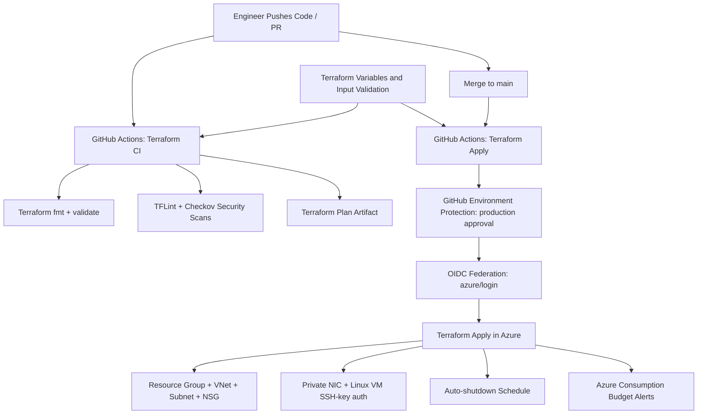

## Project Title & Badges

# Enterprise Secure-First Azure IaC Platform

[](https://github.com/DNBLabs/First-IaC-Deployment/actions)
[](https://github.com/DNBLabs/First-IaC-Deployment/security)
[](https://github.com/DNBLabs/First-IaC-Deployment/actions/workflows/terraform-ci.yml)
[](https://github.com/DNBLabs/First-IaC-Deployment/actions/workflows/terraform-apply.yml)

## Executive Summary (The Business Value)

This project delivers a secure-by-default Infrastructure as Code platform on Azure using Terraform, enforced by GitHub Actions CI/CD gates and policy-oriented input validation. The solution reduces manual deployment risk, standardizes infrastructure provisioning, and provides auditable change control for cloud resources.

From a business perspective, this approach improves deployment reliability, cuts operational overhead through automation, and lowers security/compliance exposure by enforcing least-privilege patterns (OIDC auth, approval-gated production apply, restricted SSH CIDR, and no hardcoded secrets). It also introduces cost governance through built-in Azure consumption budgets and VM auto-shutdown scheduling.

## Architecture



## Tech Stack

- Terraform (`>= 1.6.0`) for Infrastructure as Code.
- AzureRM Terraform Provider (`~> 4.0`) for Azure resource provisioning.
- GitHub Actions for CI/CD automation and protected deployment workflow.
- `azure/login` with OpenID Connect (OIDC) for secretless CI authentication.
- TFLint for Terraform linting and static quality checks.
- Checkov for IaC security scanning.
- Azure services: Resource Group, VNet/Subnet/NSG, NIC, Linux VM, VM shutdown schedule, and resource group budget.
- PowerShell validation/test scripts for task-level contract checks.

## Security & State Management

- **Secrets handling**
  - CI uses GitHub Secrets for Azure identity values (`AZURE_CLIENT_ID`, `AZURE_TENANT_ID`, `AZURE_SUBSCRIPTION_ID`).
  - Terraform apply in CI authenticates with OIDC (`id-token: write`) instead of static cloud credentials.
  - SSH access requires a public key input (`vm_admin_ssh_public_key`), with validation to reject private key material.
  - The codebase follows a no-hardcoded-secrets pattern.

- **Infrastructure hardening highlights**
  - SSH ingress is restricted to a trusted CIDR and explicitly rejects `0.0.0.0/0`.
  - VM password authentication is disabled; SSH key authentication only.
  - Subnet default outbound internet access is disabled.
  - Production apply requires a protected GitHub Environment approval gate.

- **Terraform state**
  - Current repository code does not define a remote backend block, so Terraform state defaults to local state unless backend configuration is supplied at runtime.
  - Enterprise target state: store Terraform state in an Azure Blob Storage backend with state locking and encryption at rest, with backend access governed via RBAC and secrets sourced from GitHub Secrets and/or Azure Key Vault.

## CI/CD Pipeline

The repository implements a two-workflow pipeline:

- **Terraform CI** (`.github/workflows/terraform-ci.yml`)
  - Triggers on infrastructure code changes in push/PR.
  - Runs `terraform fmt -check`, `terraform init -backend=false`, and `terraform validate`.
  - Runs `tflint` and `checkov` for linting and security checks.
  - Performs an authenticated Terraform plan and uploads a plan artifact for review.

- **Terraform Apply** (`.github/workflows/terraform-apply.yml`)
  - Triggers on push to `main`.
  - Enforces `production` environment approval before deployment.
  - Performs OIDC login to Azure and runs Terraform `init` + `apply`.

## FinOps / Cost Estimation

Estimated monthly cost for the default baseline deployment (single Linux VM + networking + monitoring controls in UK region) is approximately **$20-$45 USD/month**:

- Linux VM `Standard_B1s`: about **$10-$20/month** (region and runtime dependent).
- Managed OS Disk (`Standard_LRS`): about **$2-$6/month**.
- Network and ancillary charges (data egress, operational overhead): variable, typically **$0-$15/month** for low-traffic lab workloads.
- Budget and shutdown controls help constrain spend by reducing idle runtime and surfacing forecasted overspend early.

Use the [Azure Pricing Calculator](https://azure.microsoft.com/pricing/calculator/) for environment-specific forecasts.

## Deployment Instructions

1. Clone the repository.

   ```bash
   git clone https://github.com/DNBLabs/First-IaC-Deployment.git
   cd First-IaC-Deployment
   ```

2. Ensure prerequisites are installed and authenticated.

   ```bash
   terraform version
   az version
   gh --version
   az account show --output table
   ```

3. Provide required Terraform inputs.

   ```bash
   export TF_VAR_vm_admin_ssh_public_key="ssh-ed25519 AAAA... replace_with_your_public_key"
   ```

4. Initialize and validate infrastructure configuration.

   ```bash
   terraform -chdir=infra init -input=false -no-color
   terraform -chdir=infra fmt -check -recursive
   terraform -chdir=infra validate
   ```

5. Generate a plan and review changes.

   ```bash
   terraform -chdir=infra plan -input=false -out=tfplan
   ```

6. Deploy resources.

   ```bash
   terraform -chdir=infra apply -input=false tfplan
   ```

7. Optional production path via CI:
  - Push to `main`, approve the `production` environment gate, and verify the `Terraform Apply` workflow run in GitHub Actions.

## Day 2 Operations / Runbook

Common deployment/operations failure scenarios and fixes:

1. **Missing required variable `vm_admin_ssh_public_key`**
   - **Symptom:** Terraform plan/apply fails with required variable error.
   - **Fix:** Set `TF_VAR_vm_admin_ssh_public_key` to a valid single-line OpenSSH public key (`ssh-rsa` or `ssh-ed25519`) and rerun `plan`.

2. **Azure RBAC or OIDC authentication failure**
   - **Symptom:** CI fails during Azure login (for example OIDC subject mismatch or unauthorized subscription access).
   - **Fix:** Verify GitHub federated credential subject and tenant/subscription IDs, confirm service principal permissions, and ensure `AZURE_CLIENT_ID`, `AZURE_TENANT_ID`, `AZURE_SUBSCRIPTION_ID` are correctly configured in GitHub Secrets.

3. **Region/SKU and budget configuration issues**
   - **Symptom:** `SkuNotAvailable` for VM size or budget start date validation failures.
   - **Fix:** Override `TF_VAR_vm_size` to an available SKU in the selected region and set `TF_VAR_budget_time_period_start` to a valid first-of-month UTC date when required, then run a fresh `terraform plan -out=tfplan`.

Additional operational guidance:

- Deployment runbook: [`docs/runbooks/deploy.md`](docs/runbooks/deploy.md)
- Teardown runbook: [`docs/runbooks/teardown.md`](docs/runbooks/teardown.md)
